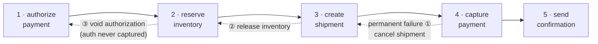
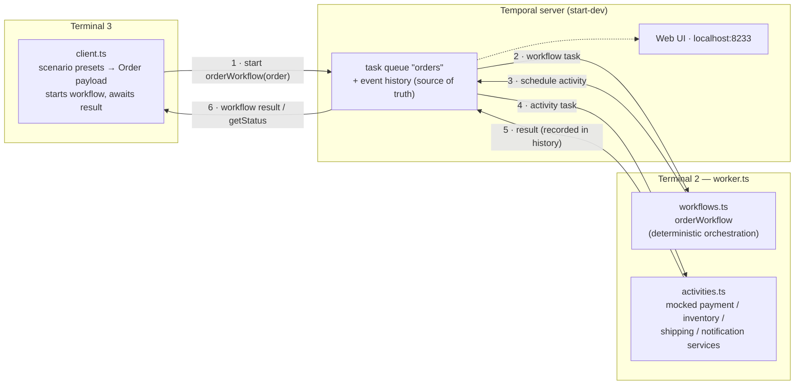

# Temporal Order Processing Demo

When an order pipeline fails halfway, the business pays three times: customers
get double-charged when a payment step is blindly retried, inventory sits
stranded in reservations that nobody releases, and support teams burn hours
answering "where is my order?" because nobody can see what state an order is
actually in. Each of those is lost revenue or lost trust. This demo shows how
Temporal eliminates all three by making the order pipeline durable, safely
retryable, and queryable at every step.

## Prerequisites

- Node.js 20+ and npm
- [Temporal CLI](https://docs.temporal.io/cli) (`brew install temporal`)

## Quick start

Three terminals:

```sh
# Terminal 1 — local Temporal server (Web UI at http://localhost:8233)
temporal server start-dev

# Terminal 2 — the worker (hosts workflow + activity code)
npm install
npm run worker

# Terminal 3 — start an order
npm run order -- happy
```

The client prints the workflow id and blocks until the order finishes
(`Workflow finished: COMPLETED`). Watch the run live — steps, payloads, event
history — at [http://localhost:8233](http://localhost:8233).

> Stopping the dev server (`Ctrl-C`) wipes its in-memory history. Use
> `temporal server start-dev --db-filename temporal.db` if you want runs to
> survive restarts.

## The workflow

One workflow, `orderWorkflow`, drives every order through five steps. Payment
is deliberately split into authorize (hold funds) and capture (charge) — the
saga pattern hinges on being able to void an authorization before capture.



After each successful step the workflow pushes an undo function onto a plain
array — the compensation stack — and each undo matches what that step actually
did: a shipment gets cancelled, an authorized-but-uncaptured payment gets
voided, a captured one gets refunded. If a later step fails permanently (the
dashed path above illustrates a capture failure), the stack unwinds in reverse:
most recent work is undone first. The order ends `FAILED_COMPENSATED` — a
completed workflow with a clean business outcome: no duplicate charge, no
stranded reservation, no live shipment for an order that won't be paid. The lone
exception is the final confirmation (step 5): a failed notification is
best-effort — it's logged and skipped, never a reason to refund and cancel a
paid, shipped order, so that order still ends `COMPLETED`.

## Scenarios

Failure injection is driven by the order's `simulate` field — never by
randomness — so every scenario is deterministic and repeatable.

| Command                             | What happens                                                                                                                                                                                                                                     | What to watch at localhost:8233                                                                                                                                                                  |
| ----------------------------------- | ------------------------------------------------------------------------------------------------------------------------------------------------------------------------------------------------------------------------------------------------ | ------------------------------------------------------------------------------------------------------------------------------------------------------------------------------------------------ |
| `npm run order -- happy`            | All five steps succeed; order ends `COMPLETED`.                                                                                                                                                                                                  | Five activities, each with realistic service latency, completing in sequence.                                                                                                                    |
| `npm run order -- flaky-inventory`  | Inventory service fails twice; Temporal retries automatically (1s, then 2s backoff) and succeeds on attempt 3. Order ends `COMPLETED` — with zero retry code in the workflow.                                                                    | The `reserveInventory` activity shows `attempt: 3` and the last failure message (`warehouse service timeout`).                                                                                   |
| `npm run order -- shipment-failure` | The carrier permanently rejects the shipment (non-retryable — retrying can't fix a bad address). The workflow compensates in reverse: releases the inventory reservation, then voids the payment authorization. Order ends `FAILED_COMPENSATED`. | `createShipment` fails once with `RETRY_STATE_NON_RETRYABLE_FAILURE` (no retries), then `releaseInventory` and `voidPaymentAuthorization` run — and the workflow **completes**, it doesn't fail. |

More scenarios (cancellation, human-in-the-loop approval) arrive in later
phases.

### 1 · Happy path

```sh
npm run order -- happy
```

**What it does:** a $99.98 order runs all five steps — authorize payment,
reserve inventory, create shipment, capture payment, send confirmation — and
ends `COMPLETED`.

**Why it matters:** this is the baseline that makes everything else readable.
The workflow is plain sequential code — no state machine, no message-queue
choreography — yet every step lands in server-side event history as it
completes. That history is what the other scenarios lean on.

**How it works:** the order carries `simulate: 'none'`, so no failure is
injected. Each mocked service takes 150–450ms (simulated latency), so the
activities have visible width on the Web UI timeline. The terminal narrates
each step in business terms: funds held, stock reserved, shipment created,
charged exactly once, customer notified.

### 2 · Transient failure, automatic retry

```sh
npm run order -- flaky-inventory
```

**What it does:** the warehouse service times out twice, Temporal retries it
automatically (after 1s, then 2s), the third attempt succeeds, and the order
still ends `COMPLETED`.

**Why it matters:** transient failure is the everyday case — every real
integration times out sometimes. The point to notice is what's *absent*: the
workflow contains zero retry code. No try/catch, no backoff loop, no dead
letter queue. Recovery is retry-policy configuration, not logic someone has to
write and maintain.

**How it works:** the order carries `simulate: 'flaky-inventory'`. The mock
inventory activity reads its own attempt number from Temporal
(`Context.current().info.attempt` — tracked server-side, so it survives worker
restarts) and throws a plain retryable `Error` on attempts 1 and 2. The retry
policy on the activity proxy (1s initial interval, 2× backoff, max 5 attempts)
re-dispatches it; the workflow never even sees the first two failures. In the
Web UI, the `reserveInventory` activity shows `attempt: 3` with the last
failure message attached.

### 3 · Permanent failure, saga compensation

```sh
npm run order -- shipment-failure
```

**What it does:** payment is authorized and inventory reserved, then the
carrier rejects the shipment outright (an unserviceable address). The workflow
undoes the completed work in reverse — releases the reservation, voids the
authorization — and ends `FAILED_COMPENSATED`.

**Why it matters:** this is the customer problem from the top of this README.
An order pipeline that dies halfway leaves a customer with a payment hold and
no shipment, and stock stranded in a reservation nobody releases. Retrying
can't fix a bad address — the only correct outcome is a clean unwind, executed
reliably even if workers crash mid-compensation.

**How it works:** the order carries `simulate: 'shipment-failure'`, and the
mock shipping service throws a **non-retryable** `ApplicationFailure` (type
`ShipmentError`) — a business-rule rejection, so the retry policy is skipped
and the activity fails on attempt 1. Control lands in the workflow's catch
block, which pops the compensation stack: after each successful forward step
the workflow had pushed an undo function onto a plain array, so the unwind
runs newest-first (release inventory, then void the authorization). The
compensations are themselves activities — they get the same retry policy as
forward steps and are idempotent — so the saga is durable too. The workflow
**completes** with a business status rather than failing: look for
`RETRY_STATE_NON_RETRYABLE_FAILURE` on `createShipment` in the Web UI,
followed by the two compensation activities, and `— customer was never charged` in the terminal.

## Status visibility

Ask any order — running or finished — where it is:

```sh
temporal workflow query --workflow-id <workflowId> --type getStatus
```

Returns the live business status (`PAYMENT_AUTHORIZED`, `INVENTORY_RESERVED`,
…, `COMPLETED`), the answer to the support team's "where is my order?".

## Durability demo: kill the worker mid-order

The most compelling live moment, and it requires zero extra code.

1. Start the retry scenario — its retry backoff makes the run last ~5 seconds,
   a comfortable window: `npm run order -- flaky-inventory`
2. As soon as the worker logs the first `warehouse service timed out` line,
   hit `Ctrl-C` on the worker (Terminal 2). The client keeps waiting; the Web
   UI shows the workflow still running — completed steps (payment
   authorization) are safe in history on the server.
3. Restart the worker: `npm run worker`
4. The order resumes exactly where it left off and finishes `COMPLETED`. Steps
   that already ran are **not** re-executed — the customer was authorized once
   and will be charged once.

The workflow survives because all state lives in the Temporal server's event
history; the worker is a stateless executor that can come and go.

## Architecture: what happens when you run `npm run order -- happy`



The pieces, in the order they touch an order:

1. **[src/client.ts](src/client.ts)** maps the scenario name (`happy`) to a fixed
   `Order` payload — including the `simulate` field that drives failure
   injection — and asks the Temporal server to start `orderWorkflow` with a
   unique workflow id. It then blocks on the result. The client never talks to
   the worker; **everything flows through the server**.
2. **The Temporal server** persists the request as event history and puts a
   workflow task on the `orders` task queue. History is the source of truth:
   every step below is recorded there, which is what makes workflows resumable
   after a crash.
3. **[src/worker.ts](src/worker.ts)** is a stateless host that long-polls that
   task queue. It runs workflow code in a deterministic sandbox (bundled from
   `workflowsPath`) and activities as plain functions.
4. **[src/workflows.ts](src/workflows.ts)** (`orderWorkflow`) is pure
   orchestration: authorize → reserve → ship → capture → confirm. It performs
   no I/O itself — each step is an activity invocation scheduled through the
   server, and each between-step decision (status updates, retry policy,
   failure handling) is workflow logic. It also answers the `getStatus` query.
5. **[src/activities.ts](src/activities.ts)** is where side effects live: the
   five mocked services (with realistic latency), each logging a business
   narrative line like `[payment] authorized $99.98 … funds held, not yet charged`. Completed activity results are recorded in history and are never
   re-executed on replay — only unfinished work retries.
6. **[src/shared.ts](src/shared.ts)** is the contract everyone imports: the
   `Order`/`OrderStatus` types, the `simulate` failure modes, and the task
   queue name.

